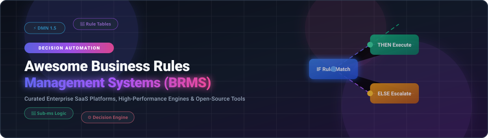

  

  
  
  
  
  
  

---

# 🚀 Awesome Business Rules Management System (BRMS) Ecosystem

A **curated list** of top-tier SaaS platforms, enterprise engines, and open-source GitHub projects dedicated to **Business Rules Management Systems (BRMS)**, **Decision Automation**, **Rule Engine Frameworks**, and **Decision Model and Notation (DMN)** governance.

> 💡 **What is a BRMS?**  
> A Business Rules Management System (BRMS) enables enterprise organizations and developers to define, deploy, execute, and govern operational business logic separately from core application code. This decouples volatile business policies for faster change management, compliance auditing, and transparent decision workflows.

---

## 📌 Table of Contents

- [☁️ SaaS & Hosted Enterprise Platforms](#%EF%B8%8F-saas--hosted-enterprise-platforms)
- [🔓 Open-Source GitHub Projects & Engines](#-open-source-github-projects--engines)
- [🛠️ Frameworks & Integration Architectures](#%EF%B8%8F-frameworks--integration-architectures)
- [🤝 How to Contribute](#-how-to-contribute)
- [⚠️ Disclaimer](#%EF%B8%8F-disclaimer)
- [📈 Star History](#-star-history)
- [💖 Support & Sponsorship](#-support--sponsorship)

---

## ☁️ SaaS & Hosted Enterprise Platforms

> 📊 **Sector Market Size & Structure**: The global Business Rules Management System (BRMS) sector is valued at approximately **$1.85 Billion USD** and is projected to reach **$4.20 Billion USD by 2030** (CAGR ~12.8%). The market is **moderately fragmented**, featuring established enterprise software giants alongside rapid-growth cloud-native challenger platforms.

The table below outlines leading commercial SaaS decision automation platforms, sorted by **Company Size / Revenue (Descending)**:

| 🏢 SaaS Platform / Vendor | 📝 Overview & Decision Automation Capabilities | 💰 Pricing (Starting Tier) | 🆓 Free Tier / Trial Limits | 📊 Company Size & Revenue |
| :--- | :--- | :--- | :--- | :--- |
| **[IBM ODM](https://www.ibm.com/products/operational-decision-manager)** | Enterprise Operational Decision Manager for automating business rules with decision tables, rule flows, and DMN governance. | Starting at **$3,300/month** per instance (or ~$0.012 per decision execution on Cloud Pak) | **30-Day Full Cloud Trial** (or 100 free executions on AWS Marketplace) | **IBM**: ~$62.5B Annual Revenue (~$200B Market Cap) |
| **[Red Hat Decision Manager](https://www.redhat.com/en/technologies/jboss-middleware/decision-manager)** | Enterprise BRMS built on Drools and Kogito for rule authoring, versioning, DMN models, and deployment governance. | Starting at **$1,000/month** ($12,000/year) per core/node subscription | **60-Day Enterprise Trial** (or No-Cost Red Hat Developer Subscription) | **Red Hat / IBM**: ~$3.5B Annual Revenue (Parent IBM: ~$62.5B) |
| **[TIBCO BusinessEvents](https://www.tibco.com/products/tibco-businessevents)** | Real-time event-driven business rules engine combining complex event processing (CEP) with decision automation. | Starting at **$2,500/month** enterprise subscription per server | **30-Day Evaluation License** available upon request via sales | **Cloud Software Group (TIBCO)**: ~$4.0B Annual Revenue |
| **[FICO Blaze Advisor](https://www.fico.com/en/products/fico-blaze-advisor-decision-rules-management-system)** | Flagship decision engine for financial services, credit risk assessment, compliance, and fraud detection decisioning. | Starting at **$4,166/month** ($50,000/year) per server deployment | **30-Day Request-Based Evaluation Trial** for qualified enterprise clients | **FICO (Fair Isaac Corp)**: ~$1.7B Annual Revenue (~$45B Market Cap) |
| **[Pega Decisioning](https://www.pega.com/products/decisioning)** | Enterprise platform combining rule engines with predictive AI, adaptive analytics, and next-best-action customer decisioning. | Starting at **$100–$250/user/month** (or case-based pricing starting ~$1,200/mo) | **30-Day Pega Community Edition Trial** (self-extendable up to 45 days) | **Pegasystems Inc.**: ~$1.4B Annual Revenue (~$4.2B Market Cap) |
| **[Progress Corticon](https://www.progress.com/corticon)** | Model-driven, no-code decision automation platform with automated integrity checks, rule flows, and decision tables. | Starting at **$1,500/month** ($18,000/year) per decision server node | **30-Day Evaluation Download** (Corticon Studio & Server sandbox) | **Progress Software**: ~$750M Annual Revenue (~$2.5B Market Cap) |
| **[DecisionRules.io](https://www.decisionrules.io/)** | Cloud-native decision engine with visual rule editor, decision tables, trees, and API-first execution. | Lite Plan at **$291/month** (billed annually); Starter plans from **$49/month** | **Free Forever Plan** (1,000 Solver API calls/mo, 10 rules/flows, 1 user) + 14-day Lite Trial | **DecisionRules s.r.o.**: ~$3M–$5M Annual Revenue (Growth Startup) |
| **[OpenRules](https://openrules.com/)** | Decision management platform allowing business analysts to author rules in Excel and deploy high-speed decision microservices. | Development + Runtime commercial license starting at **$455/month** ($5,460/year) | **Free 30-Day Evaluation Version** (Full IDE + RuleDB) / 100 free executions on AWS | **OpenRules Inc.**: ~$2M–$5M Annual Revenue |
| **[FlexRule](https://www.flexrule.com/)** | Decision automation platform featuring a visual decision designer, DMN support, and multi-tenant execution. | Developer/Team license starting at **$499/month** ($2,500/year) | **30-Day Evaluation License** & Free Demo Sandbox upon request | **FlexRule Pty Ltd**: ~$2M–$5M Annual Revenue |

---

## 🔓 Open-Source GitHub Projects & Engines

The open-source BRMS ecosystem provides high-performance decision engines, visual rule graph builders, Excel-based authoring tools, and cross-platform embedded execution runtimes.

Below are top open-source projects sorted by **GitHub Stars (Descending)**:

1. **[Rete.js](https://github.com/retejs/rete)**   
   ⚡ *Modular framework for visual programming, node-based decision graphs, and interactive rule editing in JavaScript/TypeScript.*

2. **[Drools](https://github.com/apache/incubator-kie-drools)**   
   ☕ *The most mature enterprise open-source BRMS (Apache Incubator KIE). Forward and backward chaining inference engine powered by the enhanced Rete algorithm with DMN 1.5 compliance.*

3. **[Easy Rules](https://github.com/j-easy/easy-rules)**   
   🍃 *Lightweight, POJO-based rules engine for Java applications featuring annotation-based rule definitions and expression language support (MVEL & SpEL).*

4. **[Microsoft RulesEngine](https://github.com/microsoft/RulesEngine)**   
   🔷 *Abstracted business rules engine for .NET applications allowing rules to be defined in JSON/lambdas and evaluated dynamically with high performance.*

5. **[RuleGo](https://github.com/rulego/rulego)**   
   🐹 *Lightweight, high-performance, embedded component orchestration and rule engine written in Go for IoT, enterprise business automation, and edge computing.*

6. **[Cerbos](https://github.com/cerbos/cerbos)**   
   🛡️ *Open-source, context-aware policy and authorization decision engine for writing decoupled business access control rules in YAML/WASM.*

7. **[json-rules-engine](https://github.com/CacheControl/json-rules-engine)**   
   🟨 *Forward-chaining rules engine built for Node.js and browser JS/TS. Rules defined as JSON schemas with customizable facts and async condition handlers.*

8. **[ZEN Engine (GoRules)](https://github.com/gorules/zen)**   
   🦀 *Cross-platform Business Rules Engine written in Rust with native bindings for Node.js, Python, Go, Java, C#, Kotlin, and Swift. Evaluates JDM JSON decision models in microseconds.*

9. **[NRules](https://github.com/NRules/NRules)**   
   ⚙️ *Production-proven forward-chaining rules engine for .NET based on the Rete matching algorithm using internal DSL or fluent API.*

10. **[Node-rules](https://github.com/mithunsatheesh/node-rules)**   
    📦 *Lightweight forward-chaining rule engine written in JavaScript for Node.js applications to evaluate dynamic rules and triggers.*

11. **[OpenL Tablets](https://github.com/openl-tablets/openl-tablets)**   
    📊 *Open-source BRMS allowing business analysts to author decision logic using Excel spreadsheets, compiling rules into high-speed RESTful API bytecode.*

12. **[Ordo](https://github.com/Pama-Lee/Ordo)**   
    🚀 *Rust-based decision platform featuring sub-microsecond JIT compilation (Cranelift), visual decision flows, decision table authoring, and WASM runtime.*

13. **[ZEN Engine (phenixrizen fork)](https://github.com/phenixrizen/zen)**   
    🔧 *Community-driven fork of `gorules/zen` adding embedded SQLite lookup nodes (`databaseNode`), `$params` support, and enhanced timezone handling.*

14. **[NxBRE](https://github.com/ddossot/NxBRE)**   
    💼 *.NET rule-based engine providing forward-chaining inference and XML-driven flow control engines supporting RuleML standards.*

---

## 🛠️ Frameworks & Integration Architectures

When constructing custom enterprise decision systems:
- **Enterprise Governance & Complex Events**: Pair **Drools** with event streams (Kafka) for complex event processing (CEP) and high-throughput forward chaining.
- **Excel-Driven Workflow**: Utilize **OpenL Tablets** to empower domain experts and business analysts to manage insurance, financial, or pricing rules directly in Excel.
- **Sub-Millisecond Microservice Execution**: Deploy **ZEN Engine** or **Ordo** as embedded microservices in Rust/Go/Node.js for real-time edge decisioning.
- **Lightweight App Integration**: Embed **Easy Rules** (Java), **Microsoft RulesEngine** (.NET), or **json-rules-engine** (Node.js) to decouple application policy logic cleanly without extra infrastructure overhead.

---

## 🤝 How to Contribute

Contributions are warmly welcomed! Help us keep this curated list up-to-date and accurate:

1. **Fork** this repository.
2. Add your project or SaaS platform entry into `README.md` following the tabular or badged structure.
3. Ensure links, pricing, free tier details, and descriptions are accurate and objective.
4. Submit a **Pull Request (PR)** with a clear title and description.

Check out our curated meta-list at **[Awesome-Awesome-Awesome](https://github.com/ishandutta2007/Awesome-Awesome-Awesome)** for more top-tier developer lists.

---

## ⚠️ Disclaimer

- This is a **community-curated** list for informational and educational purposes.
- Product descriptions, pricing tiers, and revenue numbers are gathered from public documentation, filings, and vendor listings. Always verify details with official vendors before making procurement decisions.
- Open-source software licenses must be evaluated against your enterprise security and compliance policies.

---

## 📈 Star History

---

## 💖 Support & Sponsorship

If you find this repository helpful for your business rules, decision automation, or software architecture work, please consider supporting the project!

- ⭐ **Star** this repository to increase its visibility.
- 🔀 **Fork** it to keep your own reference copy.
- 📢 **Share** it with your team, colleagues, or developer communities.
- ☕ **Sponsor / Buy Me a Coffee**: If you'd like to support ongoing open-source maintenance, check out the [GitHub Sponsor Dashboard](https://github.com/sponsors/ishandutta2007).

  

---

  <b>Built with ❤️ for decision architects, developers, and enterprise automation teams worldwide.</b>

